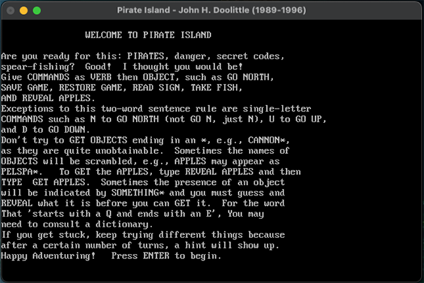
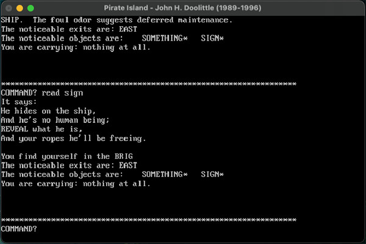

# Pirate Island macOS Port

**A native macOS port of the classic 1989–1996 text adventure** by John H. Doolittle.

## Features
- Fully playable native macOS `.app` (double-click to run)
- Proper macOS save folder (`~/Library/Application Support/PirateIsland/`)
- Custom icon and window title
- Working Save / Restore Game
- Clean exit with credits screen

## Screenshots
 &nbsp;&nbsp;&nbsp;&nbsp; 

## How to Play
1. Download the latest `Pirate Island.app` from [Releases](https://github.com/M-Endymion/pirate-island-mac-port/releases)
2. Double-click to launch
3. Type commands like `GO NORTH`, `GET FISH`, `REVEAL ORANGES`, `SAVE GAME`, etc.

## Credits
**Original Game**  
Pirate Island by John H. Doolittle  
Used in his "Scientific Thinking in Psychology" class at California State University.  
Source code released in 2023 to the [IF Archive](https://www.ifarchive.org/).

**macOS Port**  
Created by [M-Endymion](https://github.com/M-Endymion) using QB64.

## Building from Source
- Open `pirate_island_qb64.bas` in QB64 (Phoenix Edition recommended)
- Compile → Make EXE / .app only
- Create the `.app` bundle structure (see `BUILD.md` if added)

## License
This is a non-commercial historical/educational port. The original source was publicly released for preservation. Please credit John H. Doolittle when sharing.

## Links
- Original source: [IF Archive](https://www.ifarchive.org/indexes/if-archive/games/source/basic/)
- QB64: https://qb64phoenix.com/

---

**Made with ❤️ for retro computing preservation**
